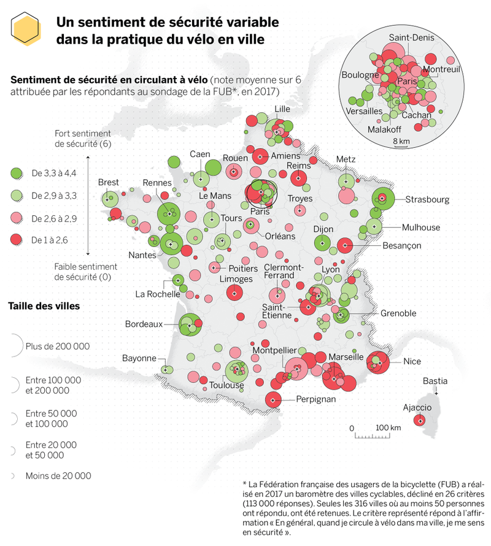
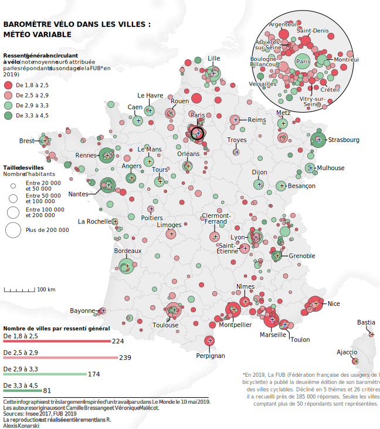

```{r setup, include=FALSE}
knitr::opts_chunk$set(fig.retina = 2,
                      fig.height = 5,
                      fig.width = 5,
                      message = FALSE,
                      warning = FALSE)
```

I recently tried to replicate a map published in Le Monde, a french newspaper. I will show you how I did it in a serie of 2 articles.
The maps will be in French, but I don't think these tutorials will be challenging for english speaker, and this first one will certainly not be.

Here is the original version :


Below is the reproduction using ggplot2 :


I am very fond of the way they draw coastal lines, and this will be the subject of this article. 

### Loading data

We will be using two geospatials datasets :  

* France boundaries : that you can find [here](https://github.com/gregoiredavid/france-geojson)
* World country boundaries : that I downlaoded [here](http://www.naturalearthdata.com/downloads/50m-cultural-vectors/)

We will be using France legal projection (Lambert-93) so we start by transforming our two dataset in that projection.


```{r}
library(tidyverse)
library(sf)
library(here)

land <- st_read(here("static/inputs/info_fub/ne_10m_admin_0_countries/ne_10m_admin_0_countries.shp")) %>% 
  st_transform(2154)

#france
france <- st_read(here("static/inputs/info_fub/departements-version-simplifiee.geojson")) %>% 
  st_transform(2154) %>% 
  st_union()

```


### Finding out the map area

We will be using France map and through trial and error figuring out the right map area.
We extract the bbox from France and then adjust it until it seems right.
We need some room in the west, nort and south. In east Corsica already give us some room to work with.

```{r}
bbox <- france %>% 
  st_bbox() + c(-100000, -180000, 12000, 180000)
bbox <- bbox %>% 
  st_as_sfc()

ggplot() +
  geom_sf(data = bbox) +
  geom_sf(data = france)

```

### Filtering world map

Next we want to take our world map, and filter it to keep only area we care about. In the process we transform the sf object in sfc objects using **st_geometry()**.  

The first operation is to remove Sardinia, it is very close to Corsica and we don't need it. To do so we only keep the largest polygon of Italy.

```{r}
italy <- land %>% 
  filter(SOVEREIGNT == "Italy") %>% 
  st_cast("POLYGON") %>% 
  filter(st_area(geometry) == max(st_area(geometry))) %>% 
  st_geometry()

```

We want countries that will appear in our final map and that have a coast. We also add Andorra, to avoid a hole between France and Spain.  

```{r}
land <- land %>% 
  filter(SOVEREIGNT %in% c("France", "Belgium", "United Kingdom",
                          "Netherlands", "Spain", "Andorra")) %>% 
  st_geometry() %>% 
  c(italy)


```


### Extracting coastlines

Really simple operations using **st_cast()** to transform polygons to lines. Then we only keep the coastlines that are within the bounding box we have defined.

```{r}
coast <- c(italy, land) %>% 
  st_union() %>% 
  st_cast("MULTILINESTRING") %>% 
  st_intersection(bbox)

ggplot() +
  geom_sf(data = coast)
```

## Creating our coastal area

We use **st_buffer** to create an area around the coastline.
The we intersect that area with our land data to remove the part of the data which is in the sea.

```{r}
coast_buffer <- coast %>% 
  st_buffer(dist = 30000) %>% 
  st_intersection(land)


ggplot() +
  geom_sf(data = coast_buffer)
```

## Creating a grid

Grid creation with ***st_make_grid**.


```{r eval=FALSE}
coast_grid <- coast_buffer %>% 
  st_make_grid(n = c(200,200)) %>% 
  st_intersection(coast_buffer)
```


```{r include=FALSE}
coast_grid <- st_read(here("static/inputs/info_fub/coast_grid.geojson"))
```


```{r}
ggplot() +
  geom_sf(data = coast_grid)
```


### Calculate distances

We calculate the distance between the center of each square of our grid and the coastline. We then bind the vector to coast_grid.

```{r}
distance <- st_distance(coast, st_centroid(coast_grid)) %>% 
  as.vector()

coast_plot <- coast_grid %>% 
  st_as_sf() %>% 
  bind_cols(dist = distance)
```

### Plotting

We use the alpha aesthetic to create the gradient.

```{r}
ggplot() +
  geom_sf(data = coast_plot,
          aes(alpha = -dist),
          fill = "grey",
          color = NA) +
  scale_alpha(range = c(0.01,0.2)) +
  coord_sf(expand = FALSE) +
  theme_void() +
  theme(legend.position = "none")
```

### Saving

We can save our spatial object in a file for later use.

```{r eval=FALSE}
st_write(coast_plot, here("static/inputs/info_fub/shaded_coast.geojson"))

```


